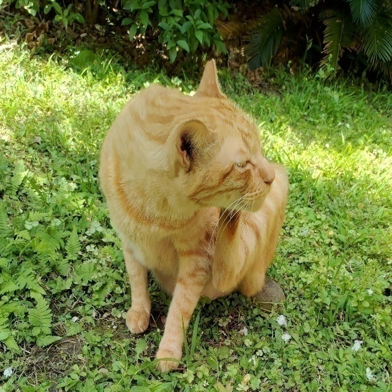

# ADSP HW3
## YCrCb 4:2:0
## Target: 
1. Convert image from BGR to YCrCb 4:4:4, then compress it to YCrCb 4:2:0.
2. Restore image YCrCb 4:2:0, then convert to BGR and show original image and compressed image.

## Environment: python 3.8

## Install Packages:
```
pip install opencv-python opencv-contrib-python numpy argparse
```

## Run th code
Default image path
```
python main.py
```
Costum image path
```
python main.py --input_img {path/to/image}
```

<div style="break-after: page; page-break-after: always;"></div>

## Result

### Original image


### Compressed image



